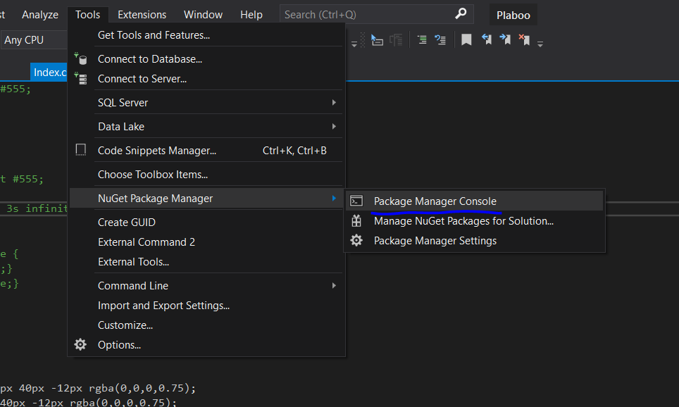
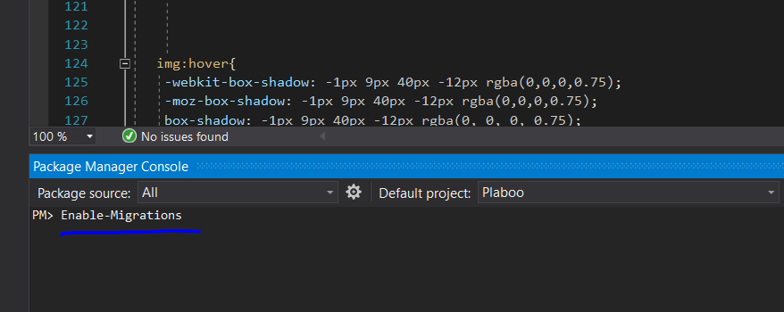
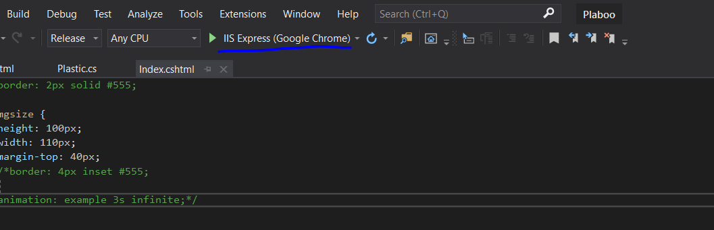

- This repository contains our main web development solution as well as the Mathematical Model developed for one of the features.
- The Mathematical model is in a '.py' file which is developed in Jupyter Notebook. Hence, Jupyter notebook or any other relevant software like pycharm can be used to view the mathematical model. Various regression and prediction models are used.
- Other than the 'Mathematical model' folder, other files and folders are used purely for the development of our website 'Plaboo'.
- Visual Studio should be used to run this project.
- Just clone the whole repository (it contains all the files needed) and open the solution in 'Visual Studio 2019'.
- Steps to follow:
1. Download the repository.
2. Migrate the database since I have used the code-first approach. Type :

   A) Open package manager console
   
   
   
   
   
   B) In the console, type: 'Enable-Migrations'
   C) Then type: 'Add-Migration init'
   D) Then type: 'Update-Database -verbose'
3. After the database is migrated, run the sql script which is in the same repository. This sql script is a wrangled script.
4. Run the IIS Server and you are good to access the website.
   
 

5. If you want to deploy the website on Azure, then create app service as well as database on Azure. After that, install SQL Server Management Studio and connect it to Azure server. Once this is done, the website is good to access!
